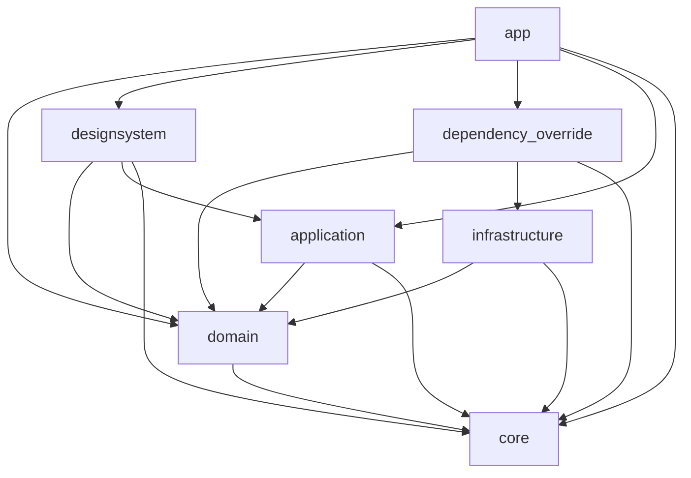

# アーキテクチャ

## 💻技術スタック

主にFlutter x Firebaseを利用しています

詳細な技術スタックについては下記の通り

### バックエンド

- [Firebase](https://firebase.google.com/?hl=ja) (App Check, Auth, Crashlytics, Firestore, Functions, Hosting, Remote Config, Storage)の利用
- [Revenue Cat](https://www.revenuecat.com)を利用したアプリ内課金
- [branch](https://www.branch.io/deep-linking/)を利用したUniversal Link

### フロントエンド

- [melos](https://pub.dev/packages/melos), [Pub workspaces](https://dart.dev/tools/pub/workspaces)を利用したmonorepo構成
- [riverpod](https://pub.dev/packages/riverpod), [riverpod_generator](https://pub.dev/packages/riverpod_generator) を利用した状態管理
- [go_router](https://pub.dev/packages/go_router), [go_router_builder](https://pub.dev/packages/go_router_builder) を利用したルーティング
- [dynamic_color](https://pub.dev/packages/dynamic_color) を利用したDynamic Color対応
  - ダークモード対応
- [flutter_launcher_icons](https://pub.dev/packages/flutter_launcher_icons) を利用したアプリアイコンの生成
  - [Themed App Icons](https://developer.android.com/about/versions/13/features?hl=ja&authuser=1#themed-app-icons) 対応
- [dart-define](https://zenn.dev/altiveinc/articles/separating-environments-in-flutter)を利用した環境別構成
- [envied](https://pub.dev/packages/envied)を利用した機密情報の難読化
- [qr_flutter](https://pub.dev/packages/qr_flutter) を利用したQRコード生成
- [responsive_framework](https://pub.dev/packages/responsive_framework) を利用したレスポンシブ対応
- [custom_lint](https://pub.dev/packages/custom_lint)を利用した静的解析のカスタマイズ

### テスト

- [mocktail](https://pub.dev/packages/mocktail) を利用したテスト

### CI/CD

- [GitHub Actions](https://github.co.jp/features/actions) を利用したCI(自動テスト/ビルド/アップロード)

## 🧭指針

**なんちゃって**オニオンアーキテクチャ + layer firstを採用しています。

`logger`などは厳密にオニオンアーキテクチャに則らず、利便性のために`utils`として全レイヤー層で利用しています。

レイヤー別の依存関係や配置するファイルについては、ざっくり下記のようにしています。


## 📁パッケージ

> [!IMPORTANT]
>
> - `domain` はDartのみで構成され、ドメインモデル・ドメインロジックを表します。
> - `designsystem` はアプリ全体のテーマや共通Widgetなどのデザインシステムを表します。
>   また、テーマに関する状態管理も含めて管理します。
> - `cores/domain` パッケージは、すべてのパッケージから呼び出されます。
> - `infrastructure` の各パッケージは `domain` に依存し `dependency_override`からのみ呼び出されます。

```text
.
├── apps
│   ├── app (アプリ本体のプレゼンテーション層)
│   └── manager (管理用Webアプリのプレゼンテーション層)
│
└── packages
    ├── core (レイヤーに囚われず利用するUtilityなど)
    ├── domain (ドメイン層/核となるドメインやインタフェース)
    │── application (アプリケーション層/業務ロジックや状態管理)
    │── dependenciy_override (依存性注入)
    │── designsystem (アプリ全体のテーマや共通Widgetなどのデザインシステム)
    │
    └── infrastructure (インフラ層/アプリ外への依存処理)
        ├── ...
        └── ...
```

### ⬇️フローチャート


